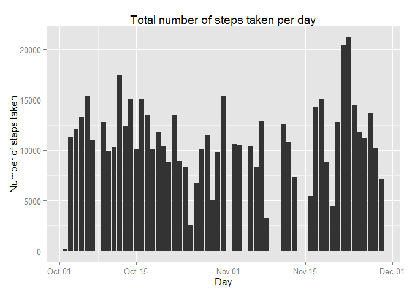
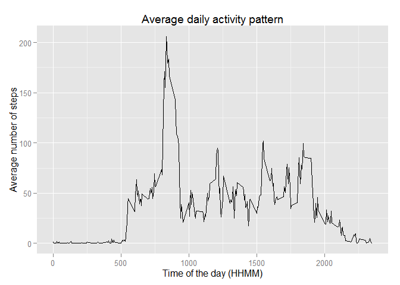
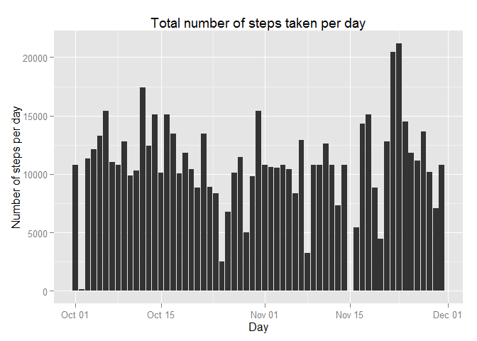

# Reproducible Research: Peer Assessment 1
Nuno Melo  
August 13, 2015  
This assignment makes use of data from a personal activity monitoring device. This device collects data at 5 minute intervals through out the day. The data consists of two months of data from an anonymous individual collected during the months of October and November, 2012 and include the number of steps taken in 5 minute intervals each day.

#Loading and preprocessing the data
The data for this assignment can be downloaded from this [link](https://d396qusza40orc.cloudfront.net/repdata%2Fdata%2Factivity.zip).
Download and copy the zip file *repdata-data-activity.zip* into your R working directory

## R Session Software environment used in the analysis

```r
sessionInfo()
```

```
## R version 3.2.0 (2015-04-16)
## Platform: x86_64-w64-mingw32/x64 (64-bit)
## Running under: Windows 7 x64 (build 7601) Service Pack 1
## 
## locale:
## [1] LC_COLLATE=English_United States.1252 
## [2] LC_CTYPE=English_United States.1252   
## [3] LC_MONETARY=English_United States.1252
## [4] LC_NUMERIC=C                          
## [5] LC_TIME=English_United States.1252    
## 
## attached base packages:
## [1] stats     graphics  grDevices utils     datasets  methods   base     
## 
## loaded via a namespace (and not attached):
##  [1] magrittr_1.5    formatR_1.2     tools_3.2.0     htmltools_0.2.6
##  [5] yaml_2.1.13     stringi_0.5-5   rmarkdown_0.7   knitr_1.10.5   
##  [9] stringr_1.0.0   digest_0.6.8    evaluate_0.7
```

## Load required packages

```r
library(dplyr)
```

```
## Warning: package 'dplyr' was built under R version 3.2.1
```

```
## 
## Attaching package: 'dplyr'
## 
## The following objects are masked from 'package:stats':
## 
##     filter, lag
## 
## The following objects are masked from 'package:base':
## 
##     intersect, setdiff, setequal, union
```

```r
library(lubridate)
library(ggplot2)
library(chron)
```

```
## Warning: package 'chron' was built under R version 3.2.1
```

```
## 
## Attaching package: 'chron'
## 
## The following objects are masked from 'package:lubridate':
## 
##     days, hours, minutes, seconds, years
```

##Load the data into R

```r
unzip(zipfile = "repdata-data-activity.zip")
data <- read.csv("activity.csv")
```
## View the data summary

```r
str(data)
```

```
## 'data.frame':	17568 obs. of  3 variables:
##  $ steps   : int  NA NA NA NA NA NA NA NA NA NA ...
##  $ date    : Factor w/ 61 levels "2012-10-01","2012-10-02",..: 1 1 1 1 1 1 1 1 1 1 ...
##  $ interval: int  0 5 10 15 20 25 30 35 40 45 ...
```

```r
summary(data)
```

```
##      steps                date          interval     
##  Min.   :  0.00   2012-10-01:  288   Min.   :   0.0  
##  1st Qu.:  0.00   2012-10-02:  288   1st Qu.: 588.8  
##  Median :  0.00   2012-10-03:  288   Median :1177.5  
##  Mean   : 37.38   2012-10-04:  288   Mean   :1177.5  
##  3rd Qu.: 12.00   2012-10-05:  288   3rd Qu.:1766.2  
##  Max.   :806.00   2012-10-06:  288   Max.   :2355.0  
##  NA's   :2304     (Other)   :15840
```
The variables included in this dataset are:

* *steps*: Number of steps taking in a 5-minute interval (missing values are coded as NA)  
* *date*: The date on which the measurement was taken in YYYY-MM-DD format  
* *interval*: Identifier for the 5-minute interval in which measurement was taken

**Note**:  
1.  There are 17568 observations  
2.  3 variables  
3.  2304 observations with missing data  
4.  *date* variable is not POSIXct type  

## Preprocess the data

```r
dfActivity <- tbl_df(data)
# Changing date from factor to POSIXct type
dfActivity$date <- ymd(dfActivity$date)

# removing missing observations
dfActivity <- dfActivity %>% filter(!is.na(steps)) %>% arrange(date)
```
#What is mean total number of steps taken per day?

```r
ggplot(dfActivity, aes(x= date, y = steps)) +
        geom_histogram(stat = "identity") +
        labs(title = "Total number of steps taken per day",
             x = "Day", y = "Number of steps taken")
```

 

```r
summary <- dfActivity %>% group_by(date) %>% summarise(total = sum(steps)) %>% ungroup
mean <- mean(summary$total); mean
```

```
## [1] 10766.19
```

```r
median <- median(summary$total); median
```

```
## [1] 10765
```

* The mean of the total number of steps per day is 
**10,766.19** 
* The median of the total number of steps per day is
**10,765**  
* **Note**: Mean and median were calculated removing NAs

# What is the average daily activity pattern?

```r
dfActivity <- dfActivity %>% group_by(interval) %>%
        mutate(averageStepsPer5Minutes = mean(steps))

ggplot(dfActivity, aes(x = interval, y =  averageStepsPer5Minutes)) +
        geom_line() +
        labs(title = "Average daily activity pattern",
             x = "Time of the day (HHMM)", y = "Average number of steps")
```

 

```r
summary <- dfActivity %>%
        summarize(maxAverage = max(averageStepsPer5Minutes)) %>%
        filter(maxAverage == max(maxAverage))
summary
```

```
## Source: local data frame [1 x 2]
## 
##   interval maxAverage
## 1      835   206.1698
```
* The 5-minute interval **835** 
has the highest average with **206.1698113** steps.

# Imputing missing values
 * There are **2304** observations with missing step count data.  
 **The strategy used to replace NAs is**: substitute NAs with the mean value for the same period of all days   
 

```r
dfActivity <- tbl_df(data)
# Changing date from factor to POSIXct type
dfActivity$date <- ymd(dfActivity$date)

# Replacing step NAs with the average number of steps taken during the same interval, averaged across all days
dfActivity <- dfActivity %>% group_by(interval) %>%
        mutate(steps = replace(steps, is.na(steps), mean(steps, na.rm = TRUE))) %>% ungroup

ggplot(dfActivity, aes(x= date, y = steps)) +
        geom_histogram(stat = "identity") +
        labs(title = "Total number of steps taken per day",
             x = "Day", y = "Number of steps per day")
```

 

```r
summary <- dfActivity %>% group_by(date) %>% summarise(total = sum(steps)) %>% ungroup
meanNoNa <- mean(summary$total); mean
```

```
## [1] 10766.19
```

```r
medianNoNa <- median(summary$total); median
```

```
## [1] 10765
```

* The mean of the total number of steps per day is
**10,766.19**
* The median of the total number of steps per day is
**10,766.19**
* The results obtained, by replacing NAs slightly as per below:
    + mean with NAs - mean without NAs = 0 steps
    + median with NAs - median without NAs = -1.1886792 steps


# Are there differences in activity patterns between weekdays and weekends?

```r
# Creating a factor variable day identifying the weekdays and weekend days
dfActivity <- dfActivity %>% mutate(day = factor(ifelse(is.weekend(date), "weekend", "weekday"))) %>%
        # Grouping by weekday/weekend and then by the same time interval
        group_by(day, interval) %>%
        # Calculating then the mean of these subgroups
        mutate(averageStepsPerDayType = mean(steps))
        
ggplot(dfActivity, aes(x = interval, y =  averageStepsPerDayType)) +
        geom_line() +
        labs(title = "Average activity pattern",
             x = "Time of the day (HHMM)", y = "Average number of steps") +
        facet_wrap(~day, ncol=1)
```

 


The two graphs show that the actvity patterns are different in weekend and weekdays. Some observations include:  

* In weekdays the individual starts walking sooner
* In weekdays at 08:35, the number of steps taken is the highest preceeded by very fast increase, being the highest of all intervals, including weekends.
* During the weekend, after 10.00 the individual is more active compared to the weekdays
